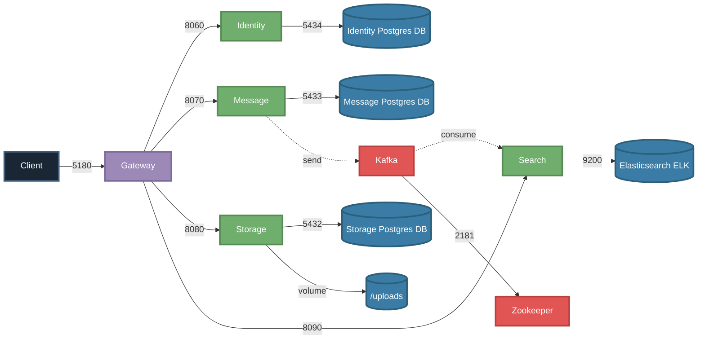

# Board
Запуск проекта:
```bash
docker-compose up --build
```



# Технологический стек

## **Архитектура**
- **Микросервисная архитектура** - приложение разделено на независимые микросервисы (Identity, Message, Storage, Search), каждый из которых решает свою конкретную задачу и может масштабироваться независимо
- **API Gateway** - единая точка входа для клиентов и маршрутизация запросов к соответствующим микросервисам

## **Бэкенд**
- **C# / .NET** - все микросервисы реализованы на платформе .NET 8.0 (ASP.NET Core)
- **Entity Framework Core** - ORM для работы с базой данных PostgreSQL в сервисах Identity, Message и Storage (через Code First подход)
- **Apache Kafka** - брокер сообщений используется для асинхронной передачи данных между сервисами
- **REST API** - взаимодействие между клиентом и сервисами через HTTP-протокол
- **Health Checks** - встроенные проверки доступности сервисов и зависимостей (БД, Kafka) для обеспечения отказоустойчивости
- **Swagger/OpenAPI** - документация API для каждого микросервиса
- **Ocelot** - API Gateway с конфигурацией маршрутов
- **xUnit** - Юнит-тесты микросервисов, покрыто >50% кода и используется Moq библиотека

## **Базы данных и хранилища**
- **PostgreSQL** - реляционная БД для хранения данных пользователей (Identity), сообщений/групп (Message) и файлов (Storage)
- **Elasticsearch (ELK)** - полнотекстовый поиска по сообщениям
- **Файловое хранилище (volume)** - физическое хранение загруженных изображений и файлов в Docker-томе `/uploads`

## **Инфраструктура**
- **Docker Compose** - настроены Docker-контейнеры (микросервисы, БД, Kafka, Elasticsearch, ZooKeeper), что обеспечивает простой запуск всей системы одной командой
- **CI/CD** - автоматизация процессов сборки и тестирования при каждом push/merge в master с использованием GitHub Actions
- **Переменные окружения** - конфигурация подключений к БД, Kafka, Elasticsearch, ZooKeeper и портов через environment variables
  
